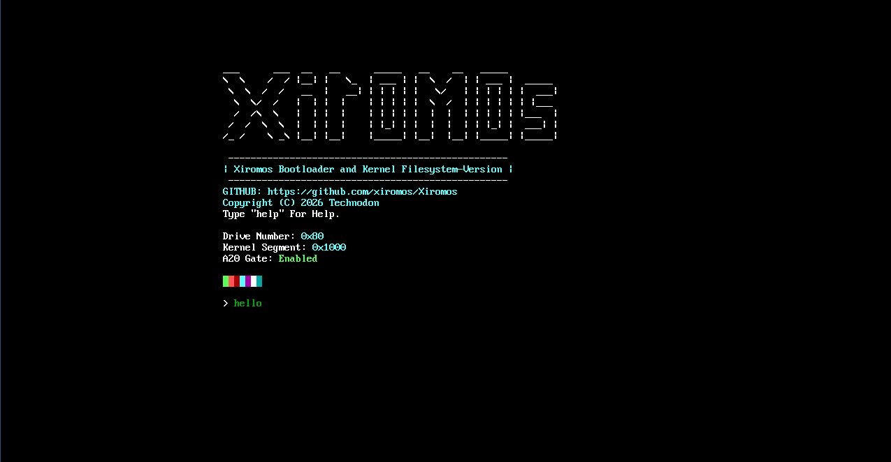
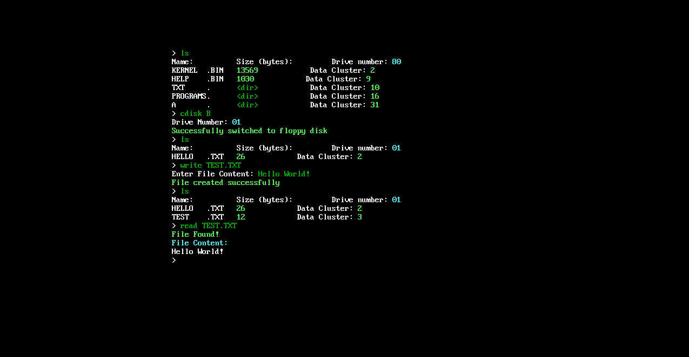
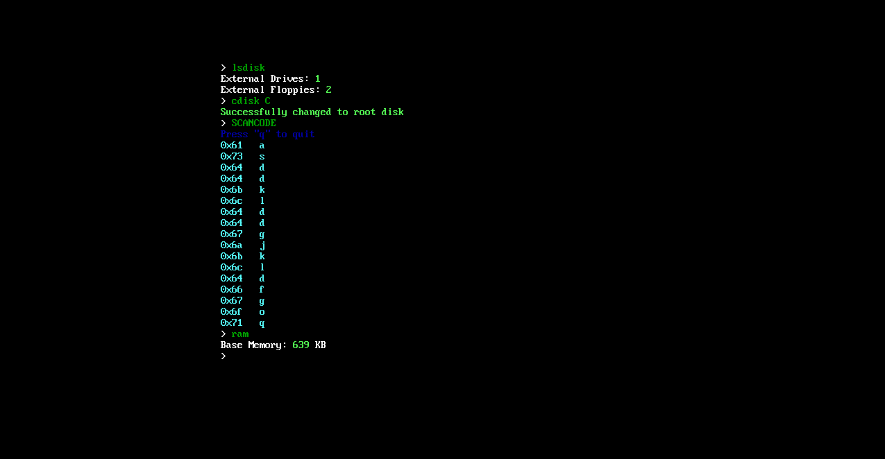
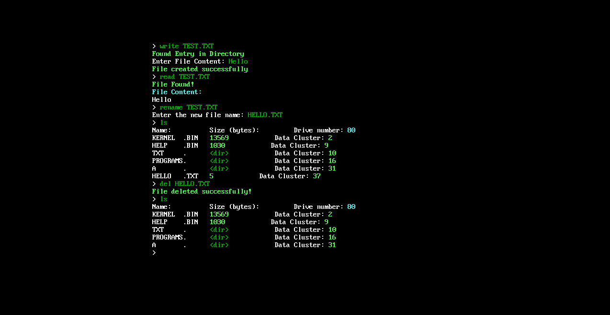
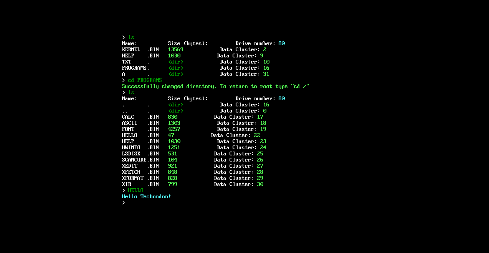
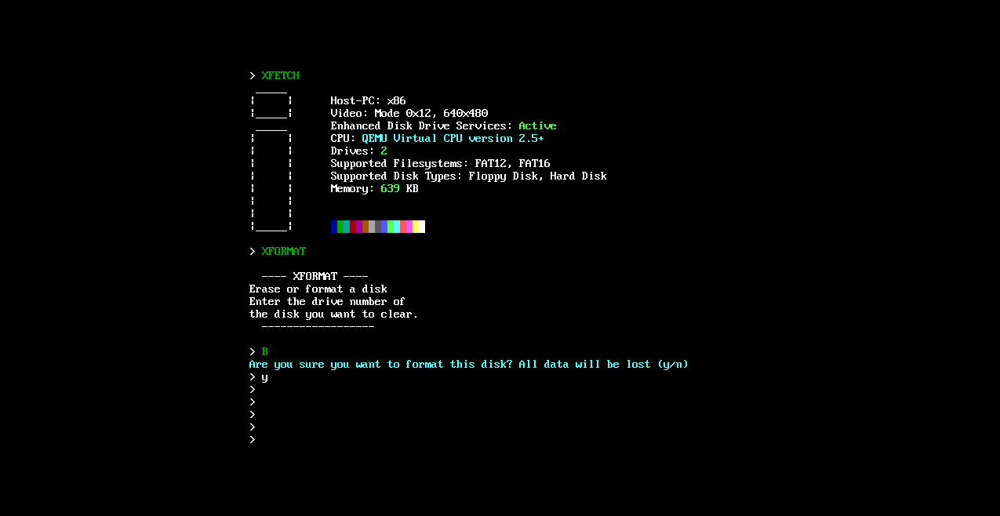
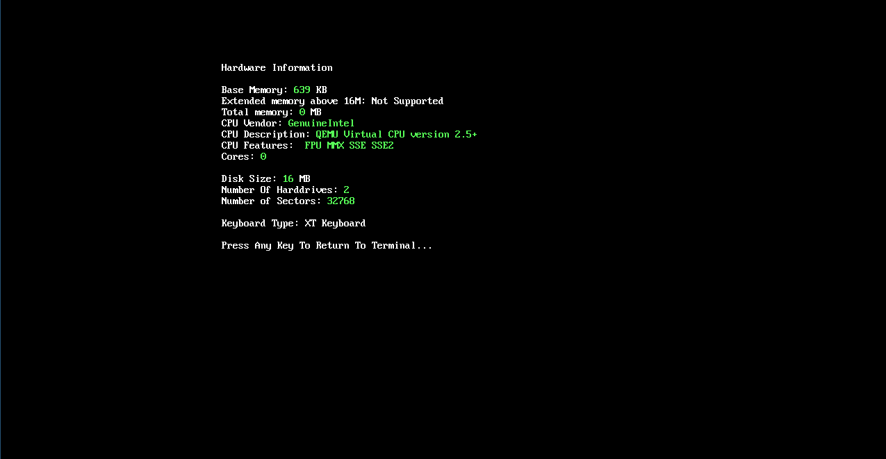

# Xiromos - 16 Bit Assembly DOS

Xiromos is a small operating system, written in Assembly entirely from
scratch. The project is under active development and new commands and functions are continuously updated.

---

## FEATURES

Xiromos works with a command-line interface and has a lot of commands. It supports the FAT12 and FAT16 filesystem and supports floppy and hard disks. It contains a bootloader, kernel and some programs.

## SCREENSHOTS









---

## COMMANDS

**Standard**<br>
HELP: show available commands<br>
CLEAR: clear the screen<br>
REBOOT: reboot the system<br>
SHUTDOWN: shutdown the system<br>

**File operations**<br>
READ: read a text file<br>
WRITE: write a text file<br>
RENAME: rename a file<br>
DEL: delete a file or a program<br>
LS: list content of the current directory<br>
MKDIR: make a directory<br>
DELDIR: delete a directory<br>

> Warning. At the moment file operations on floppy disk are unstable
> and may cause the system to freeze

## PROGRAMS<br>

CALC: simple calculator<br>
HWINFO: hardware information<br>
SCANCODE: shows the scancodes of the keyboard buttons<br>
XEDIT: texteditor<br>
XFETCH: fetch program<br>
XFORMAT: program to erase of format additional drives<br>
XIR: second texteditor<br>

## HOW TO BUILD

```bash
sudo apt/pacman install/-S qemu nasm mtools dosfstools
git clone "https://github.com/xiromos/Xiromos"
./build.sh
```

## HOW TO USE

To execute any command of program type the name of the command/program into the terminal and press ENTER. If there is any command or program you dont want to execute anymore, press 'q' to return to the terminal. To get a list of the commands type 'help'.


> Important
> Unfortunately this OS doesnt work properly on real hardware. I recommend using it in the emulator QEMU
```bash
qemu-system-i386 -hda disk.img
```

# TODO

- PS/2 Mouse driver
- implement own Assembler
- fix directory bugs
- fix the filesystem API
- make own fonts work
- maybe FAT32 support